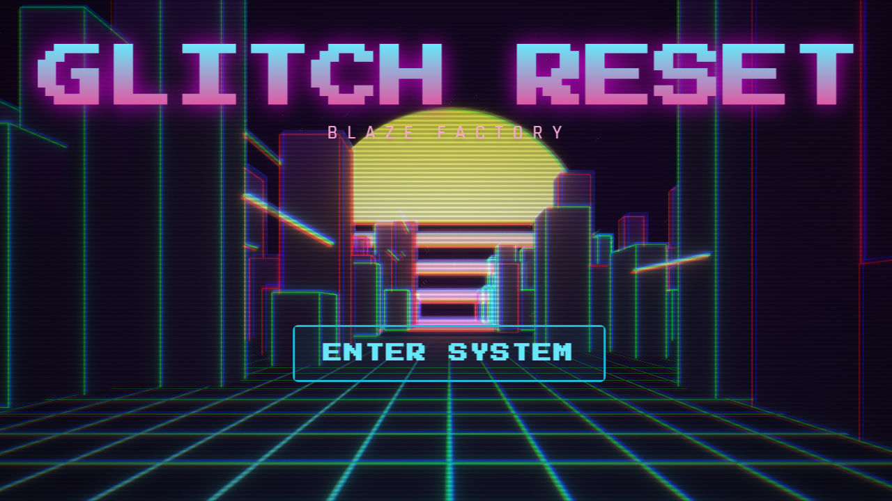

<div align="center">

</div>

# Synthwave 🌌

A stunning AI-powered synthwave art generator that creates retro-futuristic visuals with vibe coding.

## 🚀 Run Online

Experience Synthwave instantly without installation:

👉 **[https://nlnlh.github.io/synthwave/](https://nlnlh.github.io/synthwave/)**

## 🖥️ Run Locally

**Prerequisites:** Node.js 18+

1. **Clone the repository:**
   ```bash
   git clone https://github.com/nlnlh/synthwave.git
   cd synthwave
   ```

2. **Install dependencies:**
   ```bash
   npm install
   ```

3. **Run the development server:**
   ```bash
   npm run dev
   ```

4. **Open your browser:**
   Navigate to `http://localhost:5173` to start creating!

## 🤝 Contributing

Contributions are welcome! Feel free to submit issues and pull requests.

## 📄 License

MIT License - feel free to use this project for personal or commercial purposes.

## 🙏 Acknowledgments

- Built with React and Vite
- Synthwave aesthetic inspiration from the 80s retro-futurism movement
